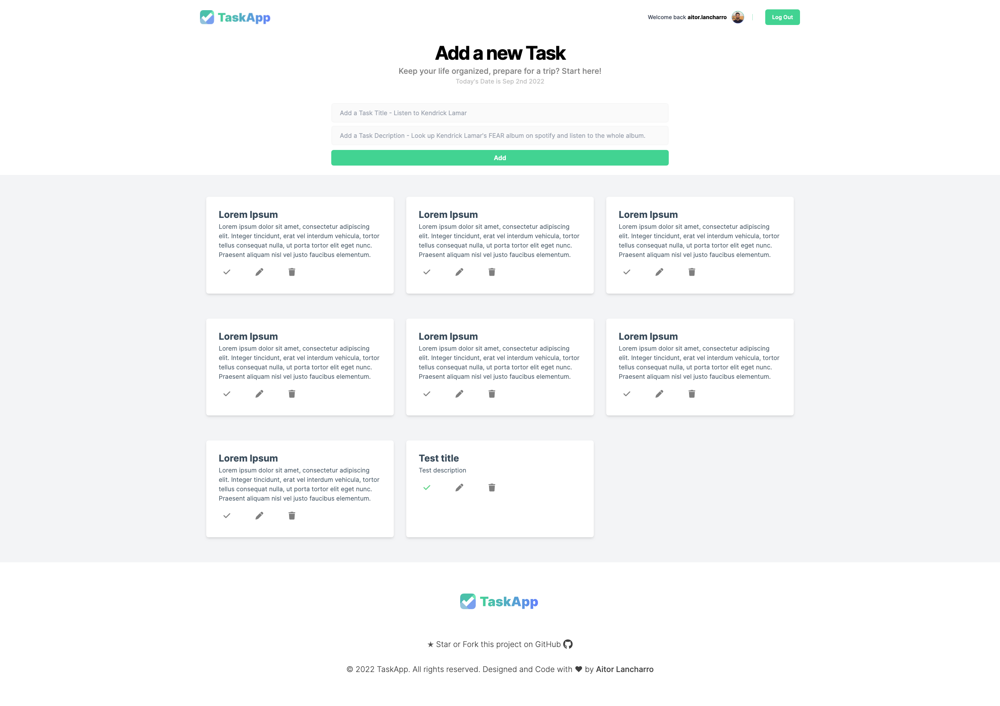

# Final Project: Task App


## Project Setup

```sh
npm install
```

### Compile and Hot-Reload for Development

```sh
npm run dev
```

### Compile and Minify for Production

```sh
npm run build
```

# UPDATES:

> "War forewarned kills no soldiers"

## Thursday August 18, 2022

We have fixed the router, and now we can access all routes.

We have implemented the SignIn function inside the User.js Store.

The next step is to create the LogIn.vue component form so we can test the Supabase DB calls.

## Friday August 19, 2022

The first thing we have done is to try to understand all the logic of Supabase.

We have created the necessary fields for the Profiles table within Supabase.

We have implemented some features in SignUp.vue.

The next steps are to finish connecting our app with supabase to be able to create new users and to be able to login correctly.

## Monday August 22, 2022

We have implemented the necessary system to show and hide the passwords in the LogIn. (Eye system).

We have created the Nav component in which we paint the user's name from the email and use a button to LogOut with all its logic.

We have added the CRUD functions to the Task Store.

## Thuesday August 23, 2022

We have added the Moment.js library to automate dates and times.

We have created all the logic to be able to paint tasks and update home automatically.

Logic for eliminating tasks.

Logic for editing tasks.

Logic for completing/incompleting tasks.

## Wednesday August 24, 2022

We add the CSS Tailwind library.

We have styled the LogIn and Signin pages.

We have deployed the project in Vercel.

## Thursday August 25, 2022

We have styled the login and signin pages.

We have styled the home page.

## Thursday August 26, 2022

We have cleaned up the code.

We have debugged style errors and implemented some improvements.

We have improved this README to use it as documentation of the same.

## Final Result


### LogIn Screen


### SignUp Screen


### Home Screen



<p align="center">Made with ❤️ and ☕️ by Aitor Lancharro</p>
